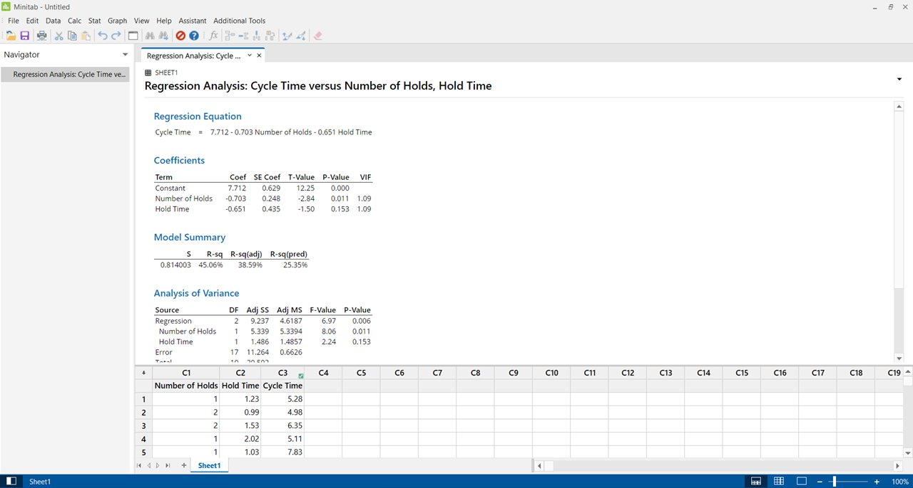
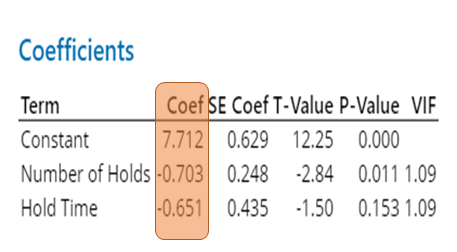
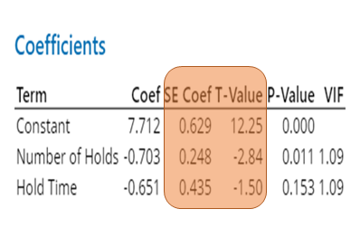
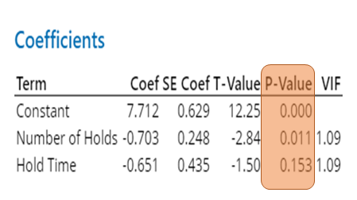
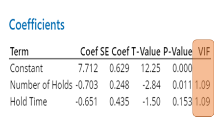
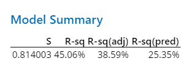
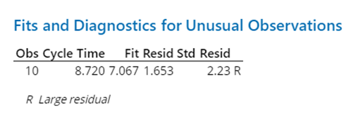
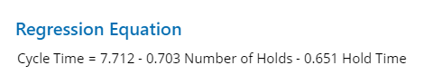
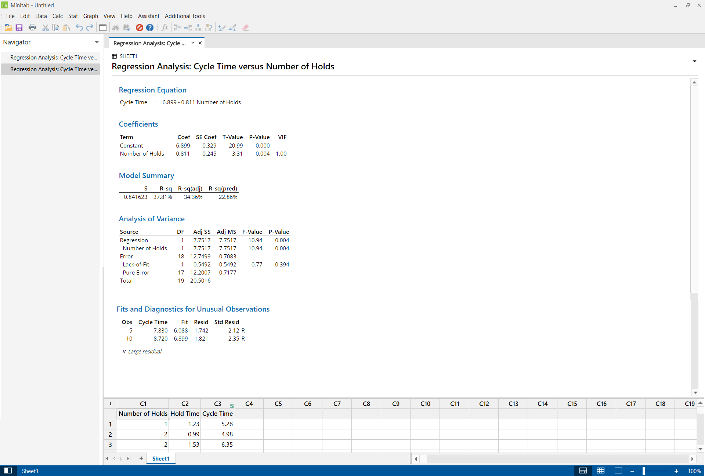
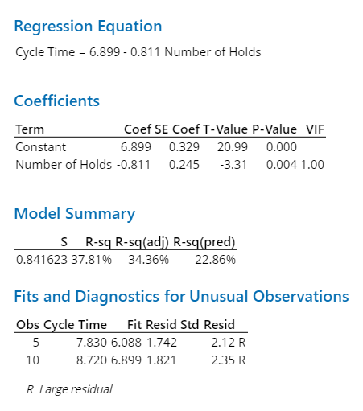

# Regression Analysis using Minitab

## Objective:

 - To analyze whether the given data can be used for predicting the
   probable cycle time of calls in a call center for consecutive time-period.
 - Method: Multiple Linear Regression.

## About the Data:

 - **Observations**: 20 observations.
### Description:
 - The given data has 20 observations with Hold time, number of holds   
   and cycle time as its attributes.
 - Dependent Variable or Response Variable: Cycle Time 
 - Independent Variable (s) or Predictor (s) : Hold Time, Number of holds
### Definition:

 - Hold Time ( in Minutes):  Time a customer spends in a queue.
 - Number of Holds: Number of customers in the queue at a time.
 - Cycle Time ( In Minutes): The total time taken by the service provider to address the customer issue. It starts from the moment the customer call and ends when the customer issue is addressed or logged.

### Data Type:

 - Hold Time and Cycle Time: Continuous Variable ( 1.23,0.99,1.53,…)
 - Number of Holds: Integer (1,2,3,…)
 
   

### Coefficient
- Helps us to understand about the magnitude(Size) and  direction of the relationship between a Independent and the dependent variable.
- From the given data, we know that the Coef of Hold time as (-0.651)  and Number of Hold (-0.703).
#### Interpretation
- For Hold Time, for every minute increase/decrease in call hold time the, cycle time decrease/increase by (-0.651) minutes.
- For Number of Hold, for every minute increase/decrease in call hold time, the cycle time decrease/increase by (-0.703) minutes.
- But there is a logical fallacy in the above interpretation.. 
- i.e., Logically, when call hold time decrease the cycle time decreases and WILL NOT Increase.
- This explains “Correlation does not imply Causation”.
- Thus we can conclude that **`the reflection from the coefficient is misleading and we cannot use the given data for prediction`**.

   

### Standard Error Coefficient:
Helps to measure the precision of the estimate of the coefficient. The smaller the standard error, the more precise the estimate. 
For the given data, the SE for both independent variables in small. Thus, we can say that the model performed well wrt to estimating the co-efficient though there exist illogical cause and effect relationship between dependent and Independent variable.

### T-value:
It helps to measure the ratio between the coefficient and its standard error. We can use T-value to determine whether to reject null hypothesis. But for this data we will use P-Value to determine statistical significance.

   
 
### P-Value
The p-value reflects the probability of falsely rejecting the Null Hypothesis while actually it is true. It is used to measures the evidence against the null hypothesis. Lower probabilities provide stronger evidence against the null hypothesis. We use P-value to determine whether the relationship between the independent and dependent variable in the model is statistically significant.
- Here P value for Number of Holds = .011. Since p-value is less than 0.05 then reject the Null Hypothesis and can conclude that there is a statistically significant relationship between the Independent and dependent variable
- But for Hold Time, P-value  = 0.153. If the p-value is greater than the significance level, we cannot conclude that there is a statistically significant association between the he Independent and dependent variable. We may want to refit the model without this variable.( after explaining the other paramets)

   

### Variance Inflation factor (VIF) 
VIF helps to determine the severity of multicollinearity in a data. Multicollinearity exist when there is a correlation between Independent variables. If a data has multicollinear Independent variables then the variance of regression coefficient increases and we can’t determine which independent variable influence the dependent variable more. The variance inflation factor (VIF) indicates how much the variance of a coefficient is inflated due to the correlations among the independent variables in the model. Generally, 
- If the VIF < 1, then there is no or less collinearity between the Independent variable.
- If VIF >  1  <= 5, then there is moderate collinearity between the Independent variable.
- If VIF > 5, the Independent variables are highly correlated.

In the given data, we can determine that VIF is less and hence the collinearity between Independent variable is less.
   

### Standard Error (S)
- S represents  the distance between the Observed value and the fitted value. Like R. Square, SD helps to determine how well the model fits the data. It carries the same unit of dependent variable. When the SE is smaller it reflects that observed value is closer to fitted value. Here, the SE is 0.814 and thus SE considered smaller.

### R Square:
- R^2 shows how much of the variation in dependent variable is explained by the Independent variable. In this model, it says that 45% of variation in dependent variable is explained by independent variable, which is too less. 

### Adjusted R Square: 
- Now the problem with using R^2 is, as we add more independent variable that are not or less corelated to dependent variable, the model the R^2 will increase rather than decreasing. So to address that issue we use adj R^2. In adj R^2 if we add more and more **uncorrelated** variables to a model, adjusted r-squared will decrease. If you add more **useful** variables, adjusted r-squared will increase.

### Predicted R Square
- The Predicted R^2 helps us to determine how well the model predicts the(dependent variable) if there is a new set observations. If predicted R^2 is high that means, the model have better predictive ability and Vice versa.

   

 
### Unusual Observation:
It shows the `“Outliers”` in the model. Observation 10 is an outlier and is not used to build the model.

  

Generally, we use the regression equation to predict for any future observations.
But for the given data, we determined that
1. There is logical fallacy between Independent and dependent variable. ( Correlation does not imply Causation)
2. P- Values of Independent variable ( Hold Time) is not statistically significant as it is greater than .05. 
3. Low R^2, Adjusted R^2, and Predicted R^2.
Hence, before concluding to reject the data unfit for prediction, lets remove the Independent variable ( Hold Time) and rerun the model and check whether there are any positive changes in the model.
   

## Regression Analysis after removing the Independent Variable (Hold Time)
   

 After removing an independent variable, we can observe that 
1. There is logical fallacy between Independent and dependent variable. (Correlation does not imply Causation) 
2. Low R^2, Adjusted R^2, and Predicted R^2.
3. We have two outliers instead of one.

   

Thus we can conclude that the given data is unfit for prediction as the model yields poor ^2, Adjusted R^2, and Predicted R^2 values and there exist logical fallacy between independent and dependent variable.        

